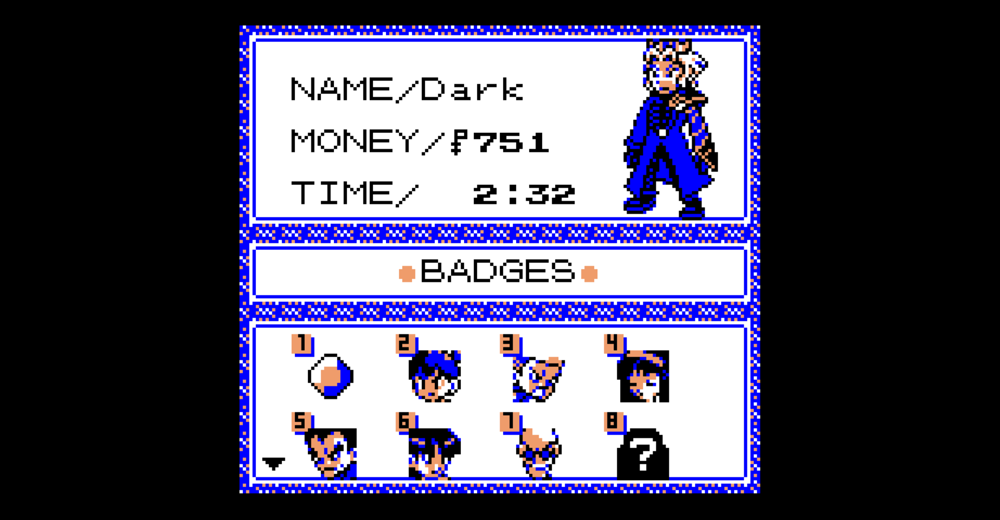
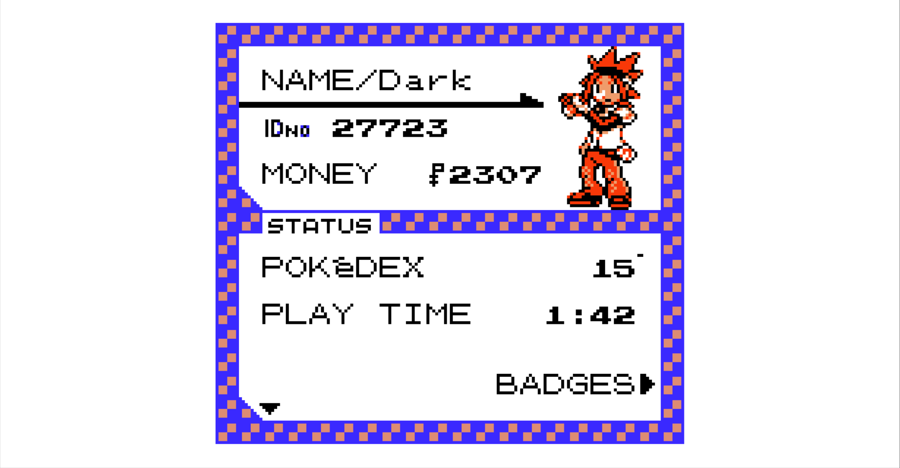
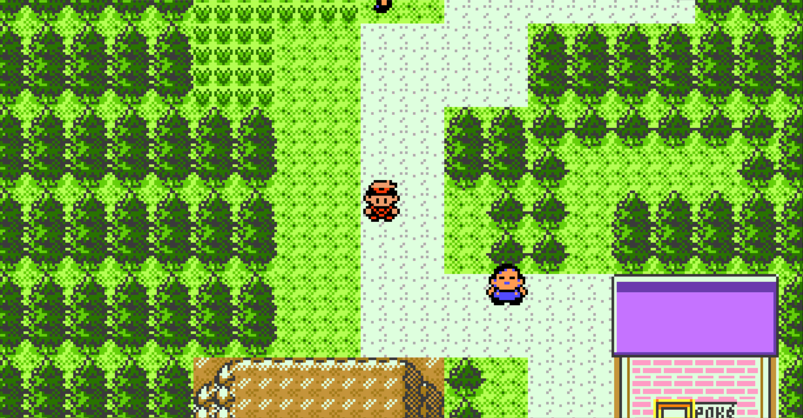
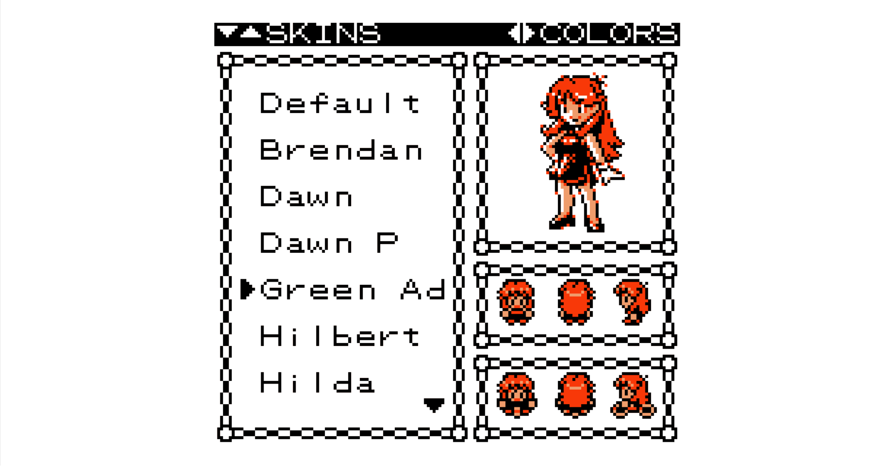
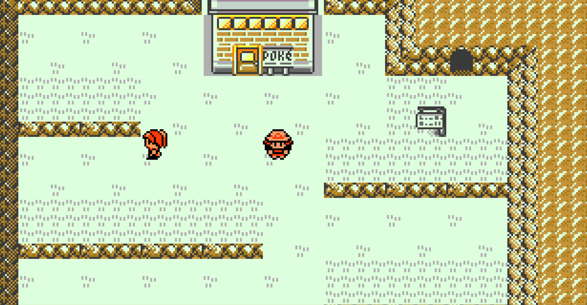

# Trainer Skins

Trainer skin mod for Pokémon Gen 1 and Gen 2 using the Gen 1 Recompilation Project

## Showcase

<p align="center">
  
  
</p>

<p align="center">
  
  
  
</p>

## Features

- Custom trainer skins
- Support for all Gen 1 & Gen 2 games
- Front and back battle sprites
- Overworld walking sprites
- Bicycle sprites
- Surf sprites
- Surfing Pikachu sprites (Pokémon Yellow & Gen2)
- Fishing sprites
- Trainer Card integration
- Red, green and blue skin palettes
- Compatibility with the recomp palette system
- Missing skin files automatically use the default trainer sprite as a fallback
- You can add or remove skins without any issues, to add a new skin go to `mods\trainer_skins\assets\skins` directory and create a folder with skin name
- The skin selection interface adapts to the frame chosen in the settings

## Skin Structure

Each skin folder supports:

```text
front.png
back.png
walk.png
bike.png
surf.png
surf_pikachu.png
fish_front.png
fish_back.png
fish_side.png
```

`surf_pikachu.png` is used for the Surfing Pikachu functionality available in Pokémon Yellow & Gen2 games

OBS: If a file is not present, the mod will use the corresponding default trainer sprite from the game

## Controls

Open the Trainer Card and press:

```text
DOWN → Open the Skins menu
```

Inside the Skins menu:

```text
UP / DOWN    Select skin
LEFT / RIGHT Change skin color
A            Equip selected skin
B            Return to Trainer Card
```

## Skin Colors

Each custom skin can use one of three base palettes:

```text
RED
GREEN
BLUE
```

The selected color acts as the base RGB palette for the skin.

The recomp palette system still controls the final displayed colors. This means game palette modes such as SGB, DMG, Classic and other palette effects continue to work normally with custom skins

## Extras

- Gen1 games has trainercard color changed to match skin pallet

## Known issues

- Darkware

## Credits

Created by:

- DarkwarePX

Special thanks to:

- Gen 1 Recompilation Project developers
- Pokémon Gen 1 and Gen 2 recomp contributors

Sprite credits:

- All skins included in this project are created by MollyChan (https://www.spriters-resource.com/profile/MollyChan/) 

## Developer Notes

The project code was created with the aid of AI, under human supervision and refinement; its goal is to create a functional and dynamic skin system.
The preview template was inspired by the character customization menu in PokeMMO. As noted, although the character's color can be changed, it may be overridden
by other color palettes. The decision to design the skin interface as an extension of the Trainer Card stemmed from observing various mods that added categories
to the main menu; I chose this approach to avoid excessive clutter, the mod was tested on the games Red and Crystal, recomp v0.2.24 – v0.2.32

## Disclaimer

This is an unofficial fan-made modification

Pokémon and all related characters, names and assets are trademarks and copyrights of Nintendo, Game Freak and The Pokémon Company

This project is not affiliated with or endorsed by Nintendo, Game Freak or The Pokémon Company
